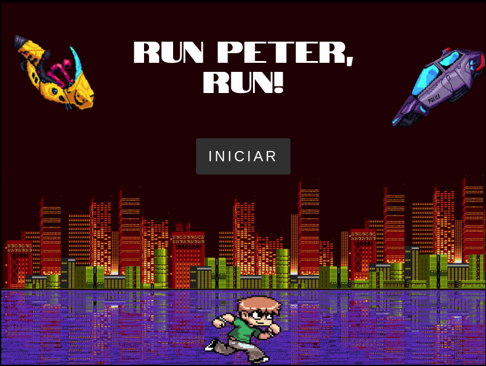

# Run Peter, Run!
Run Peter, Run! é o nome do jogo que foi realizado na semana Imersão Game Dev feito pela Alura Cursos Online.
Eu modifiquei o jogo do original mudando personagem,inimigos, adicionando um efeito parallax a o novo background e fazendo os desafios.  
 Resultado: 
 
Menu inicial:  

## 🏃‍♂ Objetivos
A cidade de Peter foi invadida por máquinas voadores, ele está tentando fugir da cidade mas as máquinas tentaram impedi-lo.

## 🎮 Como o jogo funciona?
* O personagem só poderá pular para usando o espaço ou o clique do mouse para desviar das máquinas
* Peter consegue dar pulos duplos
* Peter tem 3 vidas e cada uma será perdida a cada vez que as máquinas baterem nele, se as vidas acabarem é game over.

## 🖥 Bora jogar?!
O jogo está disponível no Github Pages, você pode acessar clicando aqui: <a href="https://marcusgoncalvess.github.io/imersaoDev/">Run Peter, Run!</a>  
O game também funciona no celular graças ao Canvas. 📱

## 🚀 Tecnologias
* HTML & CSS
* HTML Canvas (Canvas é um elemento da HTML5 destinado a delimitar uma área para renderização dinâmica de gráficos.)
* JavaScript
* P5.js (uma biblioteca JS client-side para criar experiências gráficas e interativas.)

## :memo: License

Esse projeto está sob a licença MIT. Veja o arquivo [LICENSE](./LICENSE) para mais detalhes.

---
